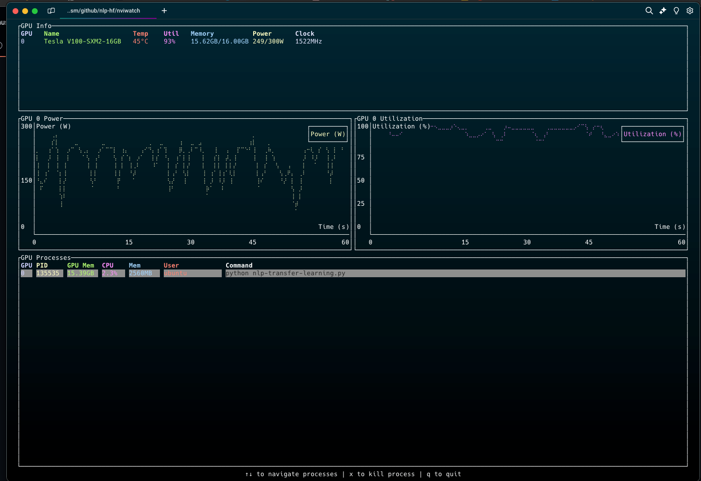

- [NviWatch](#nviwatch)
  - [Default Mode](#default-mode)
  - [Bar Mode -](#bar-mode--)
  - [Tabbed Mode: GPU graphs in tabs for multi GPU nodes](#tabbed-mode-gpu-graphs-in-tabs-for-multi-gpu-nodes)
  - [Features](#features)
  - [Installation](#installation)
  - [Usage](#usage)
  - [Key Bindings](#key-bindings)
  - [License](#license)
  - [Contributing](#contributing)
  - [Acknowledgments](#acknowledgments)


# NviWatch

NviWatch is an interactive terminal user interface (TUI) application for monitoring NVIDIA GPU devices and processes. Built with Rust, it provides real-time insights into GPU performance metrics, including temperature, utilization, memory usage, and power consumption.

## Default Mode 


## Bar Mode - 


## Tabbed Mode: GPU graphs in tabs for multi GPU nodes


## Features

- **Real-Time Monitoring**: View real-time data on GPU temperature, utilization, memory usage, and power consumption.
- **Process Management**: Monitor processes running on the GPU and terminate them directly from the interface.
- **Graphical Display**: Visualize GPU performance metrics using bar charts and tabbed graphs.
- **Customizable Refresh Rate**: Set the refresh interval for updating GPU metrics.

## Installation

To build and run NviWatch, ensure you have Rust and Cargo installed on your system. You will also need the NVIDIA Management Library (NVML) available.

1. Clone the repository:
   ```bash
   git clone https://github.com/yourusername/nviwatch.git
   cd nviwatch
   ```

2. Build the project:
   ```bash
   cargo build --release
   ```

3. Run the application:
   ```bash
   chmod +x ./target/release/nviwatch
   ./target/release/nviwatch
   ```

## Usage

NviWatch provides a command-line interface with several options:

- `-w, --watch <MILLISECONDS>`: Set the refresh interval in milliseconds. Default is 100 ms.
- `-t, --tabbed-graphs`: Display GPU graphs in a tabbed view.
- `-b, --bar-chart`: Display GPU graphs as bar charts.

Example:
```bash
./nviwatch --watch 500 --tabbed-graphs
```

## Key Bindings

- **q**: Quit the application.
- **↑/↓**: Navigate through the list of processes.
- **←/→**: Switch between GPU tabs (when using tabbed graphs).
- **x**: Terminate the selected process.

## License

This project is licensed under the GNU General Public License v3.0. See the [LICENSE](LICENSE) file for details.

## Contributing

Contributions are welcome! Please open an issue or submit a pull request for any improvements or bug fixes.

## Acknowledgments

- Built with [Rust](https://www.rust-lang.org/) and [Ratatui](https://github.com/ratatui/ratatui).
- Utilizes the [NVIDIA Management Library (NVML)](https://developer.nvidia.com/nvidia-management-library-nvml) via the [nvml_wrapper crate](https://docs.rs/nvml-wrapper/latest/nvml_wrapper/).